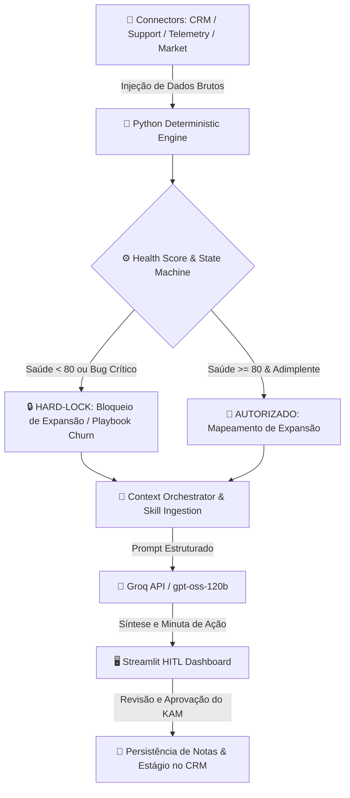

# 🛡️ CoreSaaS KAM Agent — Agentic AI Copilot

[](https://www.python.org/)
[](https://streamlit.io/)
[](https://groq.com/)
[](https://opensource.org/licenses/MIT)

> **Agente Autônomo B2B de Retenção e Expansão (Key Account Management)**, projetado para monitorar a saúde de contas SaaS, prevenir risco de churn através de travas determinísticas em Python e gerar diagnósticos estratégicos com aprovação humana (Human-in-the-Loop).

Link: https://coresaas-kam-agent-kn5ezbwuk7uxtz25tao4vv.streamlit.app/

> 💡 **Nota de Demonstração:** O link acima refere-se a um ambiente de testes criado exclusivamente para avaliação funcional do projeto. Todos os dados de contas, telemetria, chamados e contatos são **fictícios (mock data)** e foram projetados para simular cenários reais de Key Account Management sem violar privacidade ou sigilo de informações.

---

## 💡 O Desafio B2B & A Solução Agêntica

* **O Gargalo na Gestão de Contas:** Gestores de Contas (KAMs) e CSMs perdem horas cruzando manualmente dados dispersos de CRM, tickets de suporte, telemetria de uso e notícias de mercado. Quando utilizam LLMs puras, correm o risco de **alucinações em cálculos de saúde** ou **recomendações incoerentes de expansão** para contas com problemas técnicos críticos.
* **A Solução Agêntica Governada:** O **CoreSaaS KAM Agent** aplica uma arquitetura desacoplada. Um motor determinístico em Python isola os cálculos matemáticos e aplica **travas rígidas de transição de fase no CRM** (Hard-Lock). Em seguida, a LLM atua estritamente na síntese do contexto e na redação do diagnóstico, garantindo governança total e validação pelo KAM antes de registrar qualquer ação.

---

## 🧠 Biblioteca de Skills & Playbooks de Governança

O agente utiliza uma **arquitetura de habilidades desacopladas** em Markdown (`skills/`). Cada um dos 6 módulos funciona como um especialista virtual que orienta o orquestrador na condução de planos de ação específicos:

| Skill / Módulo | Função Prática na Conta | Impacto na Retenção e Expansão |
| :--- | :--- | :--- |
| 🚨 **Churn Risk Playbook**<br>`kam-churn-risk.md` | Mapeia indicadores de atrito (SLA violado, bugs críticos abertos, queda de MAU e perda de sponsor). | Bloqueia ofertas indevidas, gera plano de mitigação emergencial e alerta o KAM. |
| 📈 **Expansion Mapping**<br>`kam-expansion-mapping.md` | Qualifica a conta para Upsell/Cross-sell identificando engajamento alto e adimplência financeira. | Garante abordagens comerciais apenas quando a conta está 100% saudável. |
| 🌐 **Market Signals Radar**<br>`kam-market-signals.md` | Monitora eventos externos (mudanças de C-Level/VP, fusões, aquisições e novas rodadas de investimento). | Converte movimentações do mercado em ganchos de reaproximação estratégica. |
| 📡 **Radar da Carteira**<br>`kam-radar-carteira.md` | Monitora a saúde global da carteira de clientes e identifica tendências de risco em lote. | Prioriza contas críticas e otimiza a alocação de tempo e recursos da equipe. |
| ⚙️ **Setup do Processo**<br>`kam-setup-processo.md` | Estrutura o onboarding técnico, saneamento da base de dados e alinhamento de regras iniciais. | Assegura a ativação correta da conta e previne atritos nas fases iniciais do ciclo. |
| 💎 **Value Cadence**<br>`kam-value-cadence.md` | Gerencia a cadência periódica de revisões de negócio (QBR), acompanhamento de OKRs e ROI. | Demonstra valor contínuo e consolida a relação com os tomadores de decisão. |

---

## 🏗️ Arquitetura do Sistema & Fluxo de Dados

O fluxo utiliza motores determinísticos de validação antes de invocar a LLM, garantindo a proveniência dos dados (`[VALIDADO]`, `[HIPÓTESE]`, `[NÃO DITO]`) e revisão pelo KAM (Human-in-the-Loop).



---

## 📊 Framework de Health Score & Matriz de Estágios

### Algoritmo de Saúde Ponderado

O cálculo do Health Score recalcula os pesos automaticamente caso algum pilar de dados esteja temporariamente indisponível:

> **Health Score** = Soma(Score_pilar * Peso_pilar) / Soma(Pesos_ativos)

| Pilar | Peso | Indicadores Avaliados |
| :--- | :--- | :--- |
| 📊 **Telemetria SaaS** | **35%** | Volume de Usuários Ativos (MAU), tendência de engajamento M/M e taxa de adoção de módulos. |
| 🎧 **Atendimento & Suporte** | **25%** | Quantidade de chamados abertos, tickets críticos sem resolução e violações de SLA no período. |
| 💼 **Relacionamento CRM** | **20%** | Recorrência do contato, presença de *Executive Sponsor* ativo e saneamento cadastral. |
| 💳 **Financeiro & Contratual** | **20%** | Adimplência do pagamento de mensalidades e contagem regressiva para a janela de renovação. |

### Matriz de Transição de Estágios (Ciclo de Vida)

* **MODO SETUP (S1 a S4):** Onboarding técnico, saneamento da base e validação inicial de saúde.
* **MODO OPERAÇÃO (O1 a O4):** Cadência de rotina (O1), entrega de valor (O2), mitigação de Churn (O3) e renovação (O4).
* **MODO EXPANSÃO (E1 a E4):** Mapeamento de oportunidade (E1), qualificação (E2), proposta (E3) e fechamento (E4).

---

## 🛠️ Tecnologias Utilizadas

* **Linguagem Principal:** Python 3.10+
* **Interface & Cockpit:** Streamlit (Padrão Vibecode Executivo)
* **Inference Engine:** Groq API (`openai/gpt-oss-120b`)
* **Gestão de Dependências & Segredos:** `python-dotenv` & `.streamlit/secrets.toml`
* **Arquitetura de Software:** Modular, Orientada a Objetos (POO) e Desacoplada

---

## 📂 Estrutura do Repositório

```text
coresaas-kam-agent/
├── .devcontainer/                # Configuração de ambiente containerizado
├── .streamlit/                   # Configurações e segredos da aplicação
├── connectors/                   # Ingestão de CRM, Suporte, Telemetria e Mercado
├── engine/                       # Validação determinística, Health Score e State Machine
├── instructions/                 # Prompt mestre e diretrizes de proveniência
├── skills/                       # Playbooks e módulos de inteligência em Markdown (.md)
│   ├── kam-churn-risk.md
│   ├── kam-expansion-mapping.md
│   ├── kam-market-signals.md
│   ├── kam-radar-carteira.md
│   ├── kam-setup-processo.md
│   └── kam-value-cadence.md
├── .gitignore                    # Arquivos e diretórios ignorados pelo Git
├── LICENSE                       # Licença do projeto
├── README.md                     # Documentação executiva e técnica
├── agent_orchestrator.py         # Orquestração de contexto e montagem do prompt
├── app.py                        # Interface Streamlit Human-in-the-Loop
├── llm_client.py                 # Cliente de conexão com a API da Groq
├── main_test.py                  # Testes executáveis via linha de comando
└── requirements.txt              # Módulos para deploy no Streamlit Cloud
```

---

## 📄 Licença

Este projeto é disponibilizado sob a licença [MIT](LICENSE) — livre para estudos, adaptações e demonstrações de portfólio.
